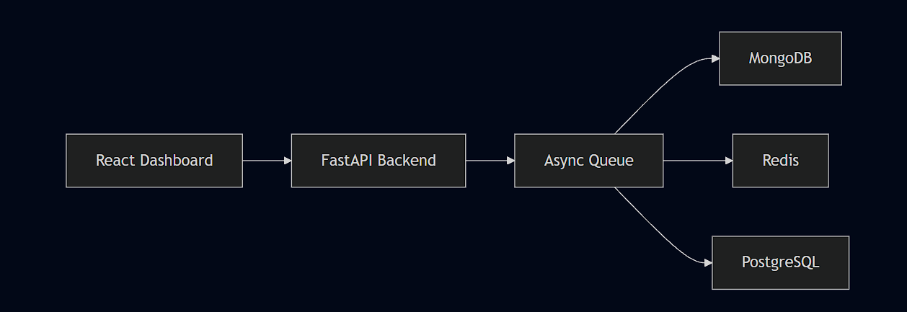

# Incident Management System (IMS)

> Mission-critical incident management platform with real-time signal ingestion, intelligent debouncing, state machine workflow, and a live React dashboard.


---

## Architecture Overview



```
┌──────────────────────────────────────────────────────────────┐
│                   React Dashboard (:5173)                    │
│                                                              │
│  ┌──────────┐  ┌────────────┐  ┌─────────┐  ┌───────────┐    │
│  │ LiveFeed │  │IncidentDtl │  │ RCAForm │  │  StatsBar │    │
│  └─────┬────┘  └──────┬─────┘  └────┬────┘  └───────────┘    │
│        │              │             │                        │
│        └──────────────┼─────────────┘                        │
│                       │ WebSocket + REST                     │
└───────────────────────┼──────────────────────────────────────┘
                        │
┌───────────────────────▼──────────────────────────────────────┐
│                 FastAPI Backend (:8000)                      │
│                                                              │
│  ┌──────────────┐      ┌──────────────────┐                  │
│  │ POST /ingest │────▶│  asyncio.Queue   │                  │
│  │ (Rate        │      │  (50K buffer)    │                  │
│  │  Limited)    │      └────────┬─────────┘                  │
│  └──────────────┘               │                            │
│                                 ▼                            │
│                     ┌──────────────────┐                     │
│                     │ Signal Processor │                     │
│                     │   (Background)   │                     │
│                     └──┬──────┬─────┬──┘                     │
│                        │      │     │                        │
│              ┌─────────┘      │     └─────────┐              │
│              ▼                ▼                ▼             │
│  │   MongoDB     │  │ Redis Stream │  │  Debouncer │         │
│  ┌───────────────┐  ┌──────────────┐  ┌────────────┐         │
│  │  (Audit Log)  │  │  (Fan-out)   │  │  (Group)   │         │
│  └───────────────┘  └──────────────┘  └──────┬─────┘         │
│                                              │               │
│                     ┌────────────────────────▼─────┐         │
│                     │ PostgreSQL (Source of Truth)  │        │
│                     │ Work Items + RCA Reports      │        │
│                     └──────────────────────────────┘         │
│                                                              │
│  ┌────────────────────────────────────────────────────────┐  │
│  │  Workflow Engine                                       │  │
│  │  State Machine: OPEN → INVESTIGATING → RESOLVED →      │  │
│  │                 CLOSED                                 │  │
│  │  Strategy:  P0 = PAGE  |  P1 = NOTIFY  |  P2 = BATCH   │  │
│  └────────────────────────────────────────────────────────┘  │
│                                                              │
│  ┌────────────────────────────────────────────────────────┐  │
│  │  Resilience Layer                                      │  │
│  │  Retry:  Exponential backoff on all DB writes (3x)     │  │
│  │  Metrics: Throughput (signals/sec) logged every 5s     │  │
│  └────────────────────────────────────────────────────────┘  │
└──────────────────────────────────────────────────────────────┘
```

---

## Quick Start

### Option A: Full Docker (One Command)

```bash
git clone <your-repo-url>
cd incident-management-system

# Start everything — databases, backend, and frontend
docker compose up --build -d
```

- **Dashboard:** http://localhost:80
- **API Docs:** http://localhost:8000/docs
- **Health Check:** http://localhost:8000/health

### Option B: Local Development

#### Prerequisites

- [Docker Desktop](https://docker.com/products/docker-desktop) (for databases)
- [Python 3.11+](https://python.org/downloads)
- [Node.js 20+](https://nodejs.org)

#### 1. Start databases

```bash
docker compose up -d postgres mongodb redis
```

#### 2. Start the backend

```bash
cd backend
pip install -r requirements.txt
python -m uvicorn app.main:app --host 0.0.0.0 --port 8000 --reload
```

#### 3. Start the frontend

```bash
cd frontend
npm install
npm run dev
```

#### 4. Open the dashboard

- **Dashboard:** http://localhost:5173
- **API Docs:** http://localhost:8000/docs
- **Health Check:** http://localhost:8000/health

---

## Simulate an Outage

```bash
python scripts/simulate_outage.py
```

This sends **300 signals** across 3 failure scenarios. Thanks to debouncing, only **3 Work Items** are created (not 300).

---

## Run Tests

```bash
cd backend
python -m pytest tests/ -v
```

**64 tests** covering:

| Test File                  | Tests | Coverage Area                                      |
| -------------------------- | ----- | -------------------------------------------------- |
| `test_retry.py`            | 8     | Exponential backoff, max retries, exception filter |
| `test_rate_limiter.py`     | 7     | Token bucket, concurrency, burst tolerance         |
| `test_api.py`              | 12    | Health, ingestion, incidents, transitions, RCA     |
| `test_signal_processor.py` | 4     | Throughput metrics, counters, WebSocket broadcast  |
| `test_debouncer.py`        | 12    | Key generation, debounce logic, strategy pattern   |
| `test_state_machine.py`    | 21    | State transitions, RCA guard, MTTR                 |

All tests use mocked databases — **no running infrastructure required**.

---

## Backpressure Handling

The system handles high-volume signal bursts (10,000+ signals/sec) through a multi-layered backpressure strategy:

1. **Rate Limiter (Token Bucket):** The `/ingest` endpoint enforces 10,000 requests/min. Excess requests receive `429 Too Many Requests`. Implemented in pure Python — works even if Redis is down.

2. **asyncio.Queue (50K Buffer):** Decouples HTTP response latency from DB write speed. The API returns `202 Accepted` in <1ms while signals queue for async processing.

3. **Backpressure Drop:** When the queue is full, signals are dropped with a warning log. In production, a dead-letter queue would capture these.

4. **Retry with Exponential Backoff:** All database writes (PostgreSQL, MongoDB, Redis) retry up to 3 times with exponential backoff (`0.5s → 1s → 2s`). Handles transient container networking issues.

### Resilience — Retry Strategy

All database operations are wrapped with the `@with_retry` decorator (`backend/app/persistence/retry.py`), which provides automatic exponential-backoff retries for transient failures.

**Wrapped Operations:**

| Database   | Operations Wrapped                                                                 |
| ---------- | ---------------------------------------------------------------------------------- |
| PostgreSQL | `create_work_item`, `update_work_item_status`, `create_rca`, `create_user`, all CRUD |
| MongoDB    | `store_signal`, `get_signals_by_source`, `get_signals_by_debounce_key`, `get_all_signals` |
| Redis      | `publish_signal`, `read_stream`, `cache_incident`, `remove_incident`, `get_active_incidents` |

**Backoff Parameters:**

- **Max retries:** 3 (initial attempt + 3 retries = 4 total attempts)
- **Delays:** `0.5s → 1s → 2s` (exponential: `base_delay × 2^(attempt-1)`, capped at `max_delay=10s`)
- **Base delay:** `0.5s`

**Retryable Exceptions (triggers retry):**

| Database   | Exception Types                                                                                       |
| ---------- | ----------------------------------------------------------------------------------------------------- |
| PostgreSQL | `OperationalError`, `DBAPIError`, `ConnectionDoesNotExistError`, `InterfaceError`, `TooManyConnectionsError` |
| MongoDB    | `AutoReconnect`, `ConnectionFailure`, `NetworkTimeout`, `ServerSelectionTimeoutError`                   |
| Redis      | `RedisConnectionError`, `RedisTimeoutError`, `BusyLoadingError`                                        |
| All        | `ConnectionError`, `ConnectionRefusedError`, `TimeoutError`, `OSError` (shared baseline)               |

**Immediate failure (no retry):** Any exception not in the retryable list (e.g., `ValueError`, `IntegrityError`, `DuplicateKeyError`) propagates immediately — these indicate logic bugs, not transient infrastructure issues.

---

## API Endpoints

| Method   | Path                         | Description                              | Auth   |
| -------- | ---------------------------- | ---------------------------------------- | ------ |
| `POST`   | `/auth/signup`               | Register a new user (first = Admin)      | —      |
| `POST`   | `/auth/login`                | Authenticate and get JWT token           | —      |
| `GET`    | `/auth/me`                   | Get current user profile                 | Bearer |
| `GET`    | `/health`                    | Health check (PG, Mongo, Redis)          | —      |
| `POST`   | `/ingest`                    | Ingest monitoring signals (rate-limited) | —      |
| `GET`    | `/incidents`                 | List all work items                      | —      |
| `GET`    | `/incidents/{id}`            | Get incident detail                      | —      |
| `PATCH`  | `/incidents/{id}/transition` | State machine transition                 | —      |
| `POST`   | `/incidents/{id}/rca`        | Submit Root Cause Analysis               | —      |
| `GET`    | `/incidents/{id}/rca`        | Get RCA for incident                     | —      |
| `GET`    | `/incidents/{id}/signals`    | Get raw signals from MongoDB             | —      |
| `GET`    | `/admin/users`               | List all users                           | Admin  |
| `PATCH`  | `/admin/users/{id}/role`     | Change user role                         | Admin  |
| `PATCH`  | `/admin/users/{id}/status`   | Enable/disable user account              | Admin  |
| `DELETE` | `/admin/users/{id}`          | Delete a user permanently                | Admin  |
| `WS`     | `/ws`                        | WebSocket live feed                      | —      |

### Ingestion Protocol & Payload Format

Signal ingestion uses a standard **HTTP POST** request to `/ingest`. The endpoint accepts both **single signals** and **batch arrays** in the same request body.

**Protocol:** `HTTP/1.1 POST` — no WebSocket or gRPC required for ingestion.

**Payload Schema (`SignalCreate`):**

| Field         | Type     | Required | Description                                        |
| ------------- | -------- | :------: | -------------------------------------------------- |
| `source`      | `string` |    ✅    | Monitoring source (e.g. `"prometheus"`, `"datadog"`) |
| `severity`    | `string` |    ✅    | Priority level — `"P0"`, `"P1"`, or `"P2"`          |
| `title`       | `string` |    ✅    | Short description of the alert                     |
| `description` | `string` |    —     | Detailed context (defaults to `""`)                 |
| `metadata`    | `object` |    —     | Free-form key-value pairs (defaults to `{}`)        |

**Single signal example:**

```json
POST /ingest
Content-Type: application/json

{
  "source": "prometheus",
  "severity": "P0",
  "title": "Redis OOM Kill detected",
  "description": "Redis container exceeded memory limit and was terminated by OOM killer.",
  "metadata": {
    "host": "redis-primary-01",
    "region": "us-east-1"
  }
}
```

**Batch ingestion example** (array of signals in a single request):

```json
POST /ingest
Content-Type: application/json

[
  { "source": "cloudwatch", "severity": "P1", "title": "CPU > 90%" },
  { "source": "cloudwatch", "severity": "P2", "title": "Disk usage > 80%" }
]
```

**Response (`202 Accepted`):**

```json
{
  "status": "accepted",
  "accepted": 2,
  "queue_depth": 42
}
```

> **Note:** Batch ingestion is fully supported — the endpoint accepts `SignalCreate | list[SignalCreate]`. Each signal in a batch is individually enqueued; if the queue fills mid-batch, remaining signals are dropped with a warning log while already-enqueued signals are still processed.

### RCA Form Fields

The Root Cause Analysis form (`RCAForm.jsx`) must be submitted before an incident can transition to `CLOSED`. All fields are **required** — the form will not submit if any field is left empty.

| Field             | UI Control          | Backend Type            | Description                                   |
| ----------------- | ------------------- | ----------------------- | --------------------------------------------- |
| **Root Cause**    | `<textarea>` (3 rows) | `Text` (NOT NULL)       | What was the underlying root cause?            |
| **Impact**        | `<textarea>` (2 rows) | `Text` (NOT NULL)       | What was the business/technical impact?        |
| **Resolution**    | `<textarea>` (2 rows) | `Text` (NOT NULL)       | How was the incident resolved?                 |
| **Prevention**    | `<textarea>` (2 rows) | `Text` (NOT NULL)       | What steps will prevent recurrence?            |
| **Incident Start**| `<input type="datetime-local">` | `DateTime(timezone=True)` | When the incident began               |
| **Incident End**  | `<input type="datetime-local">` | `DateTime(timezone=True)` | When the incident was resolved         |
| **Author**        | `<input type="text">`  | `String(100)`           | Name of the person submitting the RCA          |

**Validation Rules:**

1. All 7 fields must be non-empty (client-side `trim()` check before submission)
2. Date-time values are converted to ISO 8601 (`toISOString()`) before being sent to the backend
3. The backend enforces `NOT NULL` constraints on all columns in the `rca_reports` PostgreSQL table
4. The state machine prevents submission unless the incident is in `RESOLVED` status — you cannot submit an RCA for an `OPEN` incident

---

## Role-Based Access Control (RBAC)

The system implements a three-tier role hierarchy with JWT-based authentication:

| Permission        | Admin | Operator | Viewer |
| ----------------- | :---: | :------: | :----: |
| View Dashboard    |  ✅   |    ✅    |   ✅   |
| View Incidents    |  ✅   |    ✅    |   ✅   |
| Create Incidents  |  ✅   |    ✅    |   —    |
| Transition States |  ✅   |    ✅    |   —    |
| Submit RCA        |  ✅   |    ✅    |   —    |
| Manage Users      |  ✅   |    —     |   —    |
| Change Roles      |  ✅   |    —     |   —    |
| Delete Users      |  ✅   |    —     |   —    |

- **First user** to register is auto-promoted to `ADMIN`
- Subsequent users default to `VIEWER` (admin can promote)
- Passwords are hashed with `bcrypt`
- Sessions persist via `localStorage` JWT tokens (24h expiry)

---

## Tech Stack

| Layer            | Technology       | Purpose                           |
| ---------------- | ---------------- | --------------------------------- |
| Ingestion API    | Python + FastAPI | Async HTTP server, WebSockets     |
| In-Memory Buffer | asyncio.Queue    | Absorbs 10K signals/sec bursts    |
| Message Broker   | Redis Streams    | Durable fan-out to workers        |
| Data Lake        | MongoDB          | Raw signals — audit log           |
| Source of Truth  | PostgreSQL       | Work Items + RCA (ACID)           |
| Cache            | Redis Sorted Set | Dashboard hot-path O(1) reads     |
| Aggregation Sink | Redis Streams    | Timeseries signal aggregation     |
| Frontend         | React + Vite     | Live dashboard + RCA form         |
| Containers       | Docker Compose   | One-command full-stack deployment |

### Tech Stack Justification

- **PostgreSQL** was chosen for Work Items and RCA reports because these are transactional, relational records. State transitions (OPEN → CLOSED) must be **ACID-compliant** — a partial status change or orphaned RCA is unacceptable. PostgreSQL's foreign key from `rca_reports` → `work_items` enforces referential integrity at the database level, and `TIMESTAMPTZ` handles timezone-aware MTTR calculations correctly.

- **MongoDB** serves as the raw signal data lake because signals are **append-only, high-volume, and schema-flexible**. Different monitoring sources (Prometheus, Datadog, CloudWatch) send entirely different `metadata` shapes. MongoDB's schemaless design absorbs this without migrations, and its WiredTiger engine provides excellent write throughput for burst ingestion.

- **Redis** fills two roles. As a **Sorted Set cache**, it delivers sub-millisecond dashboard reads — active incidents are scored by severity (`P0=300, P1=200, P2=100`) so the dashboard fetches "top incidents" via a single `ZREVRANGE` in O(log N). As a **Streams broker**, it provides durable fan-out of ingested signals to multiple consumers.

- **FastAPI** was selected for its **async-native** architecture (built on Starlette + `asyncio`), first-class **WebSocket support** for the live dashboard feed, and **automatic OpenAPI docs** at `/docs` — ideal for a system that needs to handle 10K+ concurrent signal writes without blocking.

### Timeseries Aggregation Sink

**Redis Streams** acts as the timeseries aggregation sink. Every signal processed by the signal processor is published to a Redis Stream (`signal_stream`) with fields including `signal_id`, `source`, `severity`, `title`, and a full JSON payload.

This supports queries such as:
- **Signals per component over time** — `XRANGE` on the stream filtered by `source` field
- **Error rate windows** — count stream entries within a time range to compute signals/sec
- **Fan-out processing** — consumer groups can subscribe to process the same stream for alerting, analytics, or archival

The stream is capped at 10,000 entries (`XADD ... MAXLEN 10000`) to bound memory usage while retaining a rolling window of recent signal activity.

**How this differs from the MongoDB audit log:** MongoDB stores every signal permanently as a complete document for forensic analysis and compliance. Redis Streams store a rolling window of recent signals optimised for real-time aggregation, fan-out, and dashboard throughput metrics — they are ephemeral and capped, not an audit trail.

---

## Design Patterns

| Pattern               | Where Used         | Interview Answer                                                          |
| --------------------- | ------------------ | ------------------------------------------------------------------------- |
| **State**             | Incident lifecycle | Each state (OPEN/INVESTIGATING/RESOLVED/CLOSED) owns its transition rules |
| **Strategy**          | Alerting logic     | Swaps P0/P1/P2 alert behaviour at runtime without if/else chains          |
| **Producer-Consumer** | Signal ingestion   | asyncio.Queue decouples HTTP ingest speed from DB write speed             |
| **Repository**        | Persistence layer  | Database access isolated behind clean async functions                     |
| **Decorator**         | Retry logic        | `@with_retry` wraps all DB operations with exponential backoff            |

---

## Project Structure

```
incident-management-system/
├── docker-compose.yml                # Full stack — DBs + Backend + Frontend
├── README.md                         # This file
├── ARCHITECTURE.md                   # Deep technical decisions
├── PROMPTS.md                        # All AI prompts used
│
├── backend/
│   ├── Dockerfile                    # Multi-stage build with tests
│   ├── requirements.txt              # Python dependencies
│   ├── pyproject.toml                # Pytest configuration
│   ├── tests/
│   │   ├── test_retry.py             # Retry decorator tests (8)
│   │   ├── test_rate_limiter.py      # Token bucket tests (7)
│   │   ├── test_api.py              # API integration tests (12)
│   │   ├── test_signal_processor.py  # Processor + metrics tests (4)
│   │   ├── test_debouncer.py         # Debounce + strategy tests (12)
│   │   └── test_state_machine.py     # State machine + RCA tests (21)
│   └── app/
│       ├── main.py                   # FastAPI entry point + WebSocket
│       ├── config.py                 # Centralised settings (env vars)
│       ├── auth/                     # JWT auth, login, signup, RBAC
│       │   ├── router.py             # /auth endpoints
│       │   ├── dependencies.py       # Role-based dependency injection
│       │   └── jwt_utils.py          # Token encode/decode
│       ├── admin/                    # User management (Admin only)
│       │   └── router.py             # /admin endpoints
│       ├── models/                   # User, Signal, WorkItem, RCA schemas
│       ├── ingestion/                # /ingest endpoint + rate limiter
│       ├── workers/                  # Signal processor + debouncer
│       ├── workflow/                 # State machine + strategy pattern
│       └── persistence/             # PostgreSQL, MongoDB, Redis + retry
│
├── frontend/
│   ├── Dockerfile                    # Vite build → nginx serving
│   ├── nginx.conf                    # SPA routing + API/WS proxy
│   └── src/
│       ├── App.jsx                   # Main layout + protected routing
│       ├── api.js                    # API helper with Bearer token
│       ├── context/AuthContext.jsx   # Auth state management
│       ├── hooks/
│       │   ├── useWebSocket.js       # Live updates
│       │   └── useTheme.js           # Dark/light mode toggle
│       ├── pages/
│       │   ├── LoginPage.jsx         # Authentication
│       │   ├── SignupPage.jsx        # Registration
│       │   └── AdminPanel.jsx        # User management (Admin)
│       └── components/              # Header, LiveFeed, IncidentDetail,
│                                     # RCAForm, Sidebar, ActivityPanel
│
└── scripts/
    ├── test_day2.py                  # Backend E2E verification
    └── simulate_outage.py            # Mock RDBMS + MCP failure (300 signals)
```

### About ARCHITECTURE.md

`ARCHITECTURE.md` documents the key technical decisions, trade-offs, and design rationale behind the system. It covers why three databases were chosen (PostgreSQL for ACID transactions, MongoDB for schema-flexible audit logs, Redis for sub-millisecond caching and message brokering), explains the producer-consumer ingestion pipeline with backpressure, details the hash-based debouncing strategy and why PostgreSQL was preferred over Redis for debounce lookups, and describes the State Machine and Strategy patterns used in the workflow engine. The document also includes a trade-offs table comparing each decision against alternatives that were evaluated and rejected (e.g., Celery + RabbitMQ, Redis-based sliding window rate limiting, Tailwind CSS, SSE vs. WebSocket).

### About PROMPTS.md

`PROMPTS.md` is committed to the repository and contains all AI prompts, specifications, and planning notes used during the development of this system. It serves as a transparent record of the iterative design process — documenting the exact instructions, constraints, and architectural goals that guided each phase of development from initial project setup through backend implementation, frontend dashboard, and final integration testing.

---

## Observability

The system prints throughput metrics to stdout every 5 seconds:

```
📊 Throughput: 12.4 signals/sec | Processed: 305 | Failed: 0 | Queue depth: 2
📊 Throughput:  0.0 signals/sec | Processed: 305 | Failed: 0 | Queue depth: 0
```

In Docker, view with: `docker logs -f ims-backend`

---

## License

MIT
